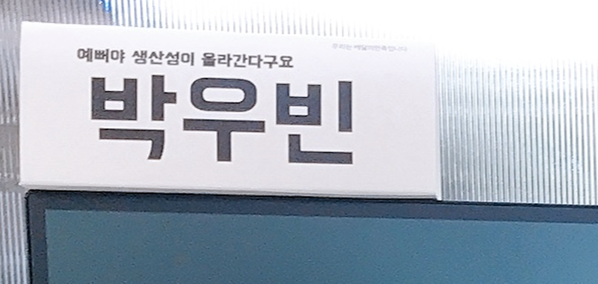

## 티스토리에서 깃헙으로

### 22년 맞이

2022년을 맞아 블로그 이전 작업을 시작했다.  

2021년 하반기에는 회사 프로젝트도 너무 바쁘고 개인사도 너무 바빠서 블로그는 커녕 개인 공부도 거의 못하고 있었는데, 프로젝트도 끝나고 개인사도 일단락되어서 1월 한달 간 재정비의 시간을 가졌다.  
몸도 마음도 쉬면서 가장 먼저 해야겠다고 생각이 든게 바로 블로그 이전 작업이었다.  

### 이전하는 이유

- 기존 블로그인 티스토리 : https://wbluke.tistory.com/  

맨 처음 개발 공부를 시작할 당시에는 Vue.js로 SPA를 띄워서 도메인 붙이고 개인 블로그를 운영했었다. (커뮤니티에서 관련 프로젝트를 했었다.)  
나중에 우아한테크코스를 시작하고 본격적으로 개발자 커리어를 쌓으면서, 지속적인 운영의 어려움으로 개인 블로그를 닫고 블로그 플랫폼으로 새롭게 시작하였다.  

 

첫 블로그 플랫폼으로 티스토리를 선택한 이유는 다음과 같았다.  
- 이미 많은 선배 개발자들이 사용중인 플랫폼
- 커스텀 스킨이 많음
- 카카오가 티스토리를 인수한 이후 좋은 기능들을 추가하고 개편해줄 것이라는 기대

 

그간 티스토리에서 작성한 글이 많지는 않지만, 햇수로 3년 정도 이용해봤는데, 다음과 같은 것들이 불편했다.  
- 안예쁘다.. (맘에 드는 스킨도 못찾았다.)
- 커스터마이징이 쉬울줄 알았지만, 생각보다 쉽지 않았다.
- 카카오에서도 여러가지를 시도해보긴 하는 것 같은데 레거시가 커서 그런지 피쳐 속도가 더디다.

`예뻐야 생산성이 올라간다구요`

내 회사 명패에 적어놓은 말인데, 주어에 따라 달리 해석할 수 있는 문구이다.  
예뻐야 한다는 말이 백엔드 개발자로서는 코드 퀄리티나 시스템 아키텍처를 의미하기도 하고,  
실제로 백엔드 개발자지만 개인적으로 눈에 보이는 프론트엔드(화면)가 예쁘면 개발 생산성이 더 향상된다고 느낀다.  
~~하지만 예쁜걸 좋아하는 것과 예쁘게 만들 수 있는 것은 정말 별개의 문제더라..~~  

위 문구를 블로그에도 적용을 해보자면, 일단 내 블로그가 예뻐야 뭔가 생산하고자 하는 의지가 샘솟는다고 해야하나,  
이전 티스토리에서는 약간 '네가 선택한 플랫폼이니 악으로 깡으로 버텨라', 하는 마음으로 글을 발행하고 있었던 것 같다.  

velog, medium, brunch 등 다른 좋은 플랫폼들을 놓고 많은 고민을 했는데, 그래도 내 마음대로 커스터마이징 할 수 있는 깃헙에 올리기로 했다.  
물론 옛날처럼 무에서 유를 만들어내기엔 배보다 배꼽이 크기 때문에, 가장 맘에 드는 개츠비(gatsby) starter로 기본 기능을 잡고 차차 커스터마이징을 하기로 했다.  
(선택한 starter는 많은 분들이 사용하고 계시는 한재엽님의 [gatsby-starter-bee](https://github.com/JaeYeopHan/gatsby-starter-bee). 감사합니다!)  

## 블로그 운영

블로그 운영 방식에도 조금 변화를 주기로 했다.  

- 기존 블로그는 경어체를 주로 고집했는데, 이제부터는 기본 문체를 평어체로 두고, 글의 주제에 따라 경어체를 혼용해보려고 한다.
    - 기술 블로그라는 특성 상, 경어체를 쓰니 말꼬리가 너무 어색하거나 문장 간 어미를 억지로 맞춰야하는 느낌이 가끔 있었다.
    - 아무래도 읽는 사람 입장에서는 경어체가 더 친근하게 다가올 수 있지만, 필요한 정보를 찾으러 방문하는 입장에서는 크게 신경쓰지 않을 것 같았다.
- 글 하나의 분량을 좀 더 light하게
    - 너무 완벽한 글을 쓰려고 하니 오히려 키보드를 잡기가 어려운 경우가 있었다. 글 하나의 분량을 줄이고, 짧은 주제로 작성할만한 내용이라면 되도록 발행하려고 한다.
- 주제를 좀 더 다양하게
    - 일단 `내 공간`이라는 생각이 드니 다양한 주제로 포스팅을 해보고 싶어졌다. (티스토리는 앞서 말한 이유로 내 공간처럼 편하다는 생각은 잘 안들었다.)
        - 최근에 있었던 가장 큰 이슈인 **내집마련기** 같은거.. 너무 사건사고가 많았는데 다 쓸 수 있을까..
- Ulysses 사용 (유료결제)
    - 기존에는 아카이빙/업무일지 용도로 노션을 사용하고, 블로그 글이나 메모 용도로는 베어(bear)를 사용하고 있었다.
    - 노션은 워낙 무겁기도 하고, 베어는 뭔가 살짝 아쉬운 감이 없지 않아 있었는데 베어의 상위 호환 격인 율리시스(Ulysses)를 보고 1년 유료결제를..🥲 해버렸다.
    - 아카이빙은 노션으로, 블로그 글과 가벼운 메모는 율리시스를 사용할 예정이다. (근데 너무 예쁘고 좋다.)

이 글 마저도 설 연휴 때 발행하려고 했으나 삽을 뜨고 마무리는 2주나 지나서..ㅋㅋ  
유익하고 편안한 블로그 라이프를 이어나가봐야겠다.  