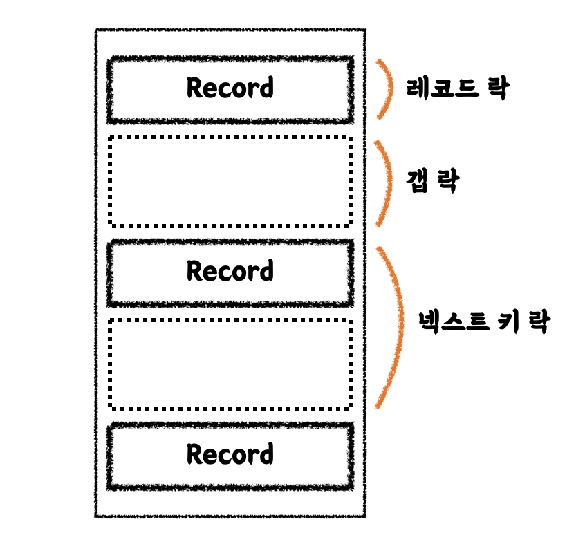

## 개념

잠금은 **동시성을 제어하기 위한 기능**이고, 트랜잭션은 **데이터 정합성을 보장하기 위한 기능**이다.

잠금이 없다면 하나의 데이터를 여러 커넥션에서 동시에 변경할 수 있게 되어, 결과적으로 해당 데이터의 값을 예측할 수가 없게 된다.  
즉 잠금은 한 시점에 하나의 커넥션만 변경할 수 있게 해주는 역할을 한다.

트랜잭션이 없다면 작업 단위의 안정성이 사라져 Partial update와 같은 현상이 발생하고, 정합성이 깨지게 된다.

## 트랜잭션

MyISAM, MEMORY 스토리지 엔진은 트랜잭션을 지원하지 않는 반면, InnoDB 스토리지 엔진은 트랜잭션을 지원한다.  
트랜잭션이 없다는 것은 Partial update가 발생한다는 것이고, 그만큼 애플리케이션 단에서 꼼꼼하게 정합성 보장을 해줘야 한다는 것을 의미하기 때문에, 트랜잭션은 복잡해 보이지만 오히려 고마운 기능이다.

트랜잭션은 최소 범위에 적용하는 것이 좋다.  
데이터베이스 커넥션은 개수가 제한적이기 때문에, 각 단위 작업이 커넥션을 소유하는 시간이 길어질수록 사용 가능한 커넥션의 수가 줄어든다.  
이는 커넥션 획득 지연을 발생시켜 웹 서버, DBMS 서버 모두를 위험하게 만들 수 있다.

## 잠금

잠금은 크게 MySQL 엔진 레벨과 스토리지 엔진 레벨로 나눌 수 있다.  
MySQL 엔진 레벨의 잠금은 모든 스토리지 엔진에 영향을 미치지만, 스토리지 엔틴 레벨의 잠금은 스토리지 엔진 간 상호 영향을 주지는 않는다.

### MySQL 엔진의 잠금

- 글로벌 락
    - 범위가 MySQL 서버 전체로 가장 범위가 크다.
    - 보통 MyISAM, MEMORY 테이블에서 mysqldump로 백업을 받을 때 사용하는데, InnoDB가 기본 스토리지 엔진이 되면서 가벼운 글로벌 락의 필요성이 생겼다. MySQL 8.0부터 백업 락이 도입되었다.
- 테이블 락
    - 개별 테이블 단위로 설정되는 잠금이다.
    - 묵시적/명시적 획득이 가능하나 명시적으로 획득할 일은 잘 없다.
    - MyISAM, MEMORY 테이블에서 데이터를 변경하면 묵시적으로 발생하는데, InnoDB 테이블의 경우 스토리지 엔진 차원에서 레코드 기반 잠금을 제공하기 때문에 묵시적 락은 발생하지 않는다. DDL의 경우에만 테이블 락이 설정된다.
- 네임드 락
    - 사용자가 지정한 문자열(String)에 대해 획득하고 반납하는 잠금이다.
- 메타데이터 락
    - 데이터베이스 객체(테이블, 뷰)의 이름이나 구조를 변경하는 경우 획득하는 잠금이다.
    - 명시적으로 획득할 수는 없고, 테이블 명세를 변경하는 경우 자동으로 획득한다.

### InnoDB 스토리지 엔진 잠금

InnoDB 스토리지 엔진은 MySQL에서 제공하는 잠금과 별개로 레코드 기반의 잠금 방식을 가지고 있어서, MyISAM보다 더 뛰어난 동시성 처리를 제공한다.  
하지만 이원화된 잠금으로 인해 이전 버전에서는 MySQL 명령을 이용해 잠금 정보를 조회하기가 쉽지 않았다.  
그러나 5.1 버전에서는 `information_schema` 데이터베이스의 `INNODB_TRX`, `INNODB_LOCKS`, `INNODB_LOCK_WAITS` 라는 테이블을 조인해서 조회하면 현재 어떤 트랜잭션이 잠금을 대기하고 있고 해당 잠금을 어느 트랜잭션이 가지고 있는지 확인할 수 있다.  
또한 장시간 잠금을 가지고 있는 클라이언트를 찾아 종료시킬 수도 있다.

- 레코드 락
    - 레코드 자체만을 잠그는 락이며, InnoDB 엔진의 특징은 레코드 자체가 아니라 인덱스의 레코드를 잠근다는 것이다. 인덱스가 없는 테이블이더라도 내부적으로 자동 생성된 클러스터 인덱스를 이용해 잠금을 설정한다.
    - 보조 인덱스를 이용한 변경 작업은 갭 락과 넥스트 키 락을 걸지만, 프라이머리 키 또는 유니크 인덱스에서의 변경 작업은 레코드 락을 사용한다.
- 갭 락
    - 레코드와 바로 인접한 레코드 사이의 간격만을 잠근다.
    - 사이 간격에 새로운 레코드가 생성되는 것을 제어한다.
- 넥스트 키 락
    - 레코드 락 + 갭 락
    - InnoDB의 갭 락이나 넥스트 키 락은 바이너리 로그에 기록되는 쿼리가 레플리카 서버에서 실행될 때 소스 서버에서 만들어 낸 결과와 동일한 결과를 만들어내도록 보장하는 것이 주목적이다. 그런데 의외로 해당 락으로 인해 데드락이 발생하거나 다른 트랜잭션을 기다리게 만드는 일이 자주 발생하므로, 가능하다면 바이너리 로그 포맷을 ROW 형태로 바꿔서 해당 락을 줄이는 것이 좋다.
        - MySQL 8.0에서는 ROW 포맷의 바이너리 로그가 기본 설정으로 변경됐다.
- 자동 증가 락
    - 순서대로 증가하는 일련번호 값을 채번하기 위한 테이블 수준의 잠금
    - INSERT, REPLACE와 같이 새로운 레코드를 저장하는 쿼리에서만 필요하다.
    - 트랜잭션과 관계 없이 AUTO\_INCREMENT 값을 가져오는 순간만 락이 걸렸다가 즉시 해제된다.
    - MySQL 5.1 이상부터는 `innodb_autoinc_lock_mode`라는 시스템 변수를 이용해 자동 증가 락의 작동 방식을 변경할 수 있다.
        - `innodb_autoinc_lock_mode=0` : MySQL 5.0과 동일한 잠금 방식으로 모든 INSERT 문장은 자동 증가 락을 사용한다.
        - `innodb_autoinc_lock_mode=1` : INSERT되는 레코드의 건수를 정확히 예측할 수 있을 때는 자동 증가 락을 사용하지 않고, 훨씬 가볍고 빠른 래치(뮤텍스)를 이용해 처리한다.
        - `innodb_autoinc_lock_mode=2` : 항상 래치(뮤텍스)를 이용해 처리한다. MySQL 8.0의 바이너리 로그 포맷이 기본 ROW 포맷으로 변경되면서 해당 설정도 2가 기본값이 되었다.

InnoDB의 잠금은 레코드를 잠그는 것이 아니라 인덱스를 잠그기 때문에, UPDATE 문 등에서 적절한 인덱스가 없다면 테이블을 풀 스캔하면서 모든 레코드를 잠글 수도 있으니 주의해야 한다.

MySQL 5.1부터는  `information_schema` 데이터베이스의 `INNODB_TRX`, `INNODB_LOCKS`, `INNODB_LOCK_WAITS` 라는 테이블을 사용해 잠금을 확인할 수 있었는데, MySQL 8.0부터는 `information_schema`의 정보들은 조금씩 제거되고 있으며, 대신 `performance_schema`의 `data_locks`와 `data_lock_waits` 테이블로 대체되고 있다.

## 격리 수준

격리 수준(isolation level)이란 여러 트랜잭션이 동시에 처리될 때, 특정 트랜잭션이 다른 트랜잭션에서 변경하거나 조회하는 데이터를 볼 수 있게 허용할지 말지를 결정하는 것이다.

- READ UNCOMMITTED (DIRTY READ)
    - 각 트랜잭션의 변경 내용이 커밋이나 롤백 여부에 상관없이 다른 트랜잭션에서 보인다.
    - RDBMS 표준에서는 격리 수준으로 인정하지 않을 정도로 정합성에 문제가 많다.
- READ COMMITTED
    - 오라클 DBMS의 기본 격리 수준이다.
    - 커밋된 데이터만 다른 트랜잭션에서 조회할 수 있다.
    - 커밋되기 전 데이터를 읽을 수 있는 이유는 해당 테이블이 아니라 언두 영역에 백업된 레코드에서 데이터를 가져오기 때문이다.
    - 하나의 트랜잭션 내에서 같은 SELECT 쿼리를 실행했을 경우 그 사이에 데이터가 바뀌면 결과가 달라진다. REPEATABLE READ 정합성에 어긋난다.
- REPEATABLE READ
    - MySQL InnoDB 스토리지 엔진의 기본 격리 수준이다.
    - 변경되기 전 레코드를 언두 공간에 백업해두고 실제 레코드 값을 변경하는데, 이를 MVCC(Multi Version Concurrency Control)이라 한다. REPEATABLE READ와 READ COMMITTED의 차이는 언두 영역에 백업된 레코드의 여러 버전 가운데 몇 번째 이전 버전까지 찾아 들어가야 하느냐에 있다.
    - 모든 트랜잭션은 순차적으로 증가하는 고유한 트랜잭션 번호를 가지며, 언두 영역의 모든 백업 레코드에는 변경을 발생시킨 트랜잭션의 번호가 포함돼 있다. 언두 영역의 데이터는 전체가 보관될 필요는 없고, 특정 트랜잭션 번호의 구간 내에서 백업되기만 하면 된다. 예를 들어 10번이라는 트랜잭션에서 반복적으로 데이터를 조회하는 경우, 트랜잭션 번호가 10번보다 작은 언두 데이터만 조회하도록 하는 것이다.
    - SELECT ... FOR UPDATE 쿼리는 SELECT 하는 레코드에 쓰기 잠금을 걸어야 하는데, 언두 레코드에는 잠금을 걸 수 없어 현재 레코드의 값을 가져와야만 한다. 이렇게 되면 조회할 때마다 값이 보였다 안보였다 할 수 있는데, 이런 현상을 PHANTOM READ(PHANTOM ROW)라고 한다.
    - InnoDB 스토리지 엔진에서는 갭 락과 넥스트 키 락 덕분에 PHANTOM READ가 발생하지 않는다.
- SERIALIZABLE
    - 읽기 작업도 공유 잠금을 획득해야만 하며, 동시에 다른 트랜잭션은 해당 레코드를 변경할 수 없게 된다.
    - PHANTOM READ가 발생하지 않는다.

뒤로 갈수록 각 트랜잭션 간의 데이터 격리(고립) 정도가 높아지며, 동시 처리 성능도 떨어지는 것이 일반적이다.  
